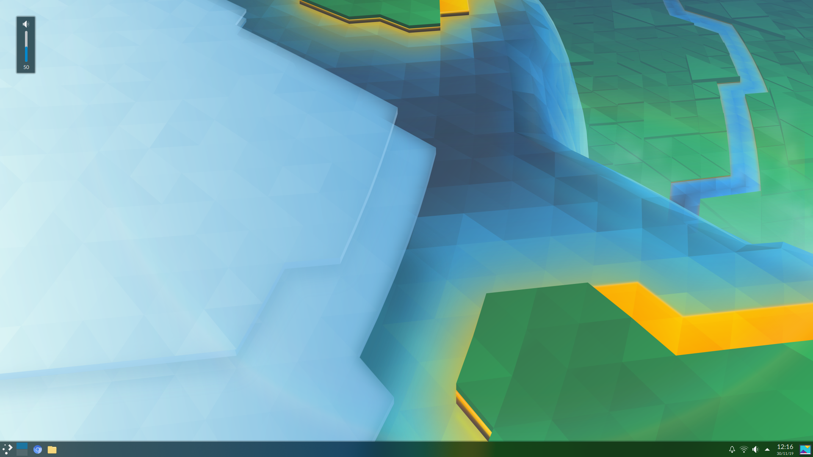

# Windows 10 Style OSD for KDE Plasma

I made a few hacks for myself that get the big OSD out of the way and pretty much make it look the Windows 10 one. It's somewhat different in the sense that there's still an icon and that Plasma doesn't want to show a progress bar when audio volume is 0.

If someone else is interested in making such modifications, this is where they need to be made:

`/usr/share/plasma/look-and-feel/org.kde.breeze.desktop/contents/osd/Osd.qml`

Code: https://raw.githubusercontent.com/flipwise/kdewin10osd/master/Osd.qml

`/usr/share/plasma/look-and-feel/org.kde.breeze.desktop/contents/osd/OsdItem.qml`

Code: https://raw.githubusercontent.com/flipwise/kdewin10osd/master/OsdItem.qml

Obviously this is going to get overwritten on the next update so it's good to create your own look and feel theme with these changes.

Disclaimer: I don't need text in OSDs so this is made with that assumption and I don't know how it works with multi monitor setups.
